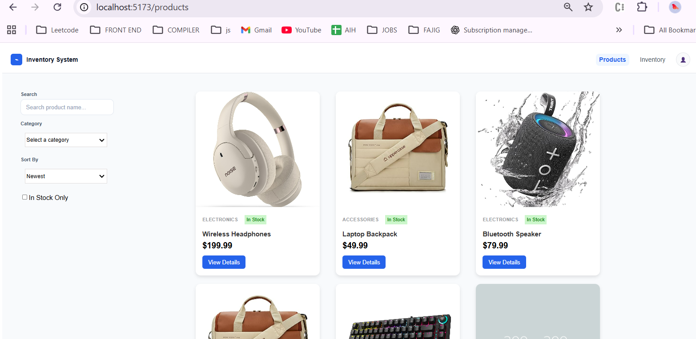
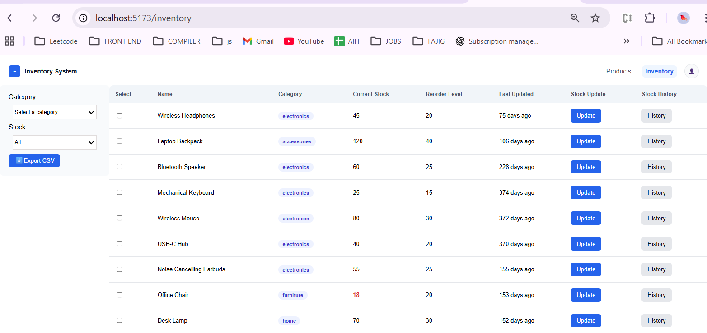

## How to set up and run the project

npm i

#

npm run dev

# Architecture Decisions & Trade-offs

1. Redux Toolkit for async + global state
   Why: Products and inventory are shared across multiple screens (listing, details, inventory table). RTK gives predictable state updates + async handling via thunks.

2. Backend-like filtering/sorting/pagination via query params
   The API spec uses query parameters, so the UI triggers re-fetch whenever filters/sort/pagination change.
   Trade-off: For MSW mocks, this logic is implemented in handlers (filter/sort/paginate arrays).

3. Search implemented client-side - Assumption
   The API spec doesn't explicitly mention a search query param. So search is implemented on the currently fetched page items.
   Trade-off: This means search is scoped to the current page only (not across the entire dataset).
   If backend search existed (e.g. search=wireless), we would debounce input and fetch server-side results.

## Assumptions Made

- Search behavior

Since /api/products doesn’t mention search param, search filters the items currently in Redux state (current page).
If full-dataset search was required, I would add search param support in MSW and debounce API calls.

- Inventory update

should reflect on product details as well
Stock exists in both Products and Inventory models.
On PUT /api/inventory/:id, MSW also updates Product mock stock so ProductDetails stays consistent.

- History endpoint

Due to time contraint, /api/inventory/:id/history returns a mock history response (static).- only for product1 and product 2
The UI supports routing and display; backend simulation can be extended later.

- Bulk update

Selection UI exists to pick multiple rows.( handled in selectedIds)
Bulk update API can be added as POST /api/inventory/bulk-update in MSW and handled similarly to single update.

# What you'd do differently with more time

- Better design UX polish for - history screen, error screens, loading screens
- More reuable components like selectbox in shared components
- Testing - unit testing
- Bulk update - proper set up as we already have the selected multiple rows just need to pass the data and perform further

## For Mocking I used MSW

- I chose MSW because it lets me mock APIs at the network layer (same as real backend calls), without changing frontend code.
- It keeps my React + Redux code production-like: thunks still call real fetch("/api/...").
- MSW makes it easy to simulate query params (pagination/sort/filter) and error/loading cases for better UX testing.
- Compared to json-server, MSW is lightweight, needs no separate server process, and works well inside a frontend repo.

## Why I Used STYLED-COMPONENTS ( CSS-IN JS )

- I used styled-components (CSS-in-JS) to keep styles scoped to individual components, preventing global CSS conflicts.
- It allows dynamic styling via props, which is useful for variants like primary/secondary buttons and conditional states.
- Styled-components integrates well with TypeScript, enabling typed style props and better developer experience.
- Co-locating styles with components improves readability and maintainability for complex UI (tables, modals, forms).

# Component Documentation:

ProductList - Renders all products in grid format, has sidebar for searching filtering and sorting
ProductDetails - show detailed view when we click on view detail button from product page

InventoryList - shows all inventory available, has button to update individual stocks, has history button to show logs,has side bar for filtering on the basis of category and lowstock

# Handler - it has MSW setup

GET /api/products?page=&limit=&sort=&order=&category=&inStock=

GET /api/products/:id

GET /api/inventory?category=&lowStockThreshold=

PUT /api/inventory/:id (updates both inventory + product stock to keep screens consistent)

GET /api/inventory/:id/history (returns mock history)

# Mock data lives under something like:

- src/mock/productData.ts
- src/mock/inventoryData.ts
- src/mock/historyMock.ts

#

# Product Inventory Management Dashboard

## Features Implemented

### Screen 1: Product Listing

- Products grid layout
- Pagination (12 per page)
- Filters: category + in-stock
- Sorting: price (asc/desc), popularity (asc/desc), newest
- Real-time search by product name (client-side)
- Loading + empty states
  

### Screen 2: Product Details

- Full product details (description, full description, specs)
- Main image + thumbnail gallery (Amazon-like)
- Stock info (current stock + “last updated” time-ago)
- Back navigation to Products

### Screen 3: Inventory Management

- Inventory table with:
  - category filter
  - low-stock threshold filter (≤ 5 / ≤ 10 / ≤ 20)
- Update stock modal (PUT /api/inventory/:id)
- Bulk selection (foundation for bulk update)
- History screen (mocked API response)
- Export CSV
  
